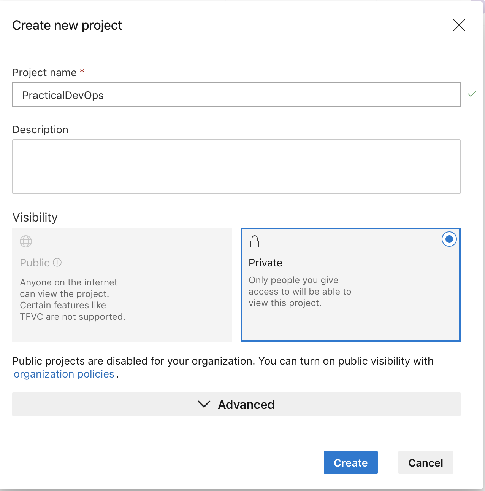
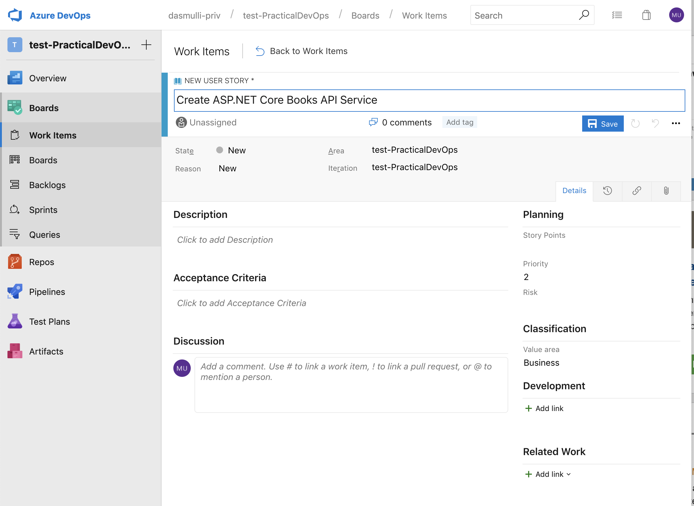

## Lab 1: Set up Azure DevOps

1. Log into https://dev.azure.com with your microsoft account.
2. Create a new project using the "+ Create project" button:


Use a fitting name for this project:


3. Create User Stories for the work we are about to do:

Use the New > User Story menu to create two user stories:


Create a story named "Create ASP:NET Core Books API Service"



Create a story named "Use dummy data from Azure Storage"


4. Go to the Repo page and copy the URL for the main git repository


5. Use your favorite editor / terminal to clone the empty repository.

> git clone https://dev.azure.com/....

You may need to use SSH keys, create alternate credentials or personal access tokens to use your GIT client with Azure Devops.

See [Authentication overview](https://docs.microsoft.com/en-us/azure/devops/repos/git/auth-overview?view=azure-devops) for available option in case you are unable to clone right away.

Personally, I recommend using SSH key authentication although it is more difficult to set up initialle. See [Use SSH key authentication](https://docs.microsoft.com/en-us/azure/devops/repos/git/use-ssh-keys-to-authenticate?view=azure-devops) for a detailed walkthrough.

6. Add the following files from this repository to your new repository:

* `.gitignore`
* `global.json`

7. Copy the `BookService` folder from the `01_Service` folder into your repository. This will be your main sample app.

8. Make soure you can run the application:

* Ensure you have the latest ASP.NET Core 2.2 compatible .NET SDK installed from [.NET Core 2.2 downloads](https://dotnet.microsoft.com/download/dotnet-core/2.2)
* Run the following command to ensure the development HTTPS certificate is trusted on your computer:
```sh
dotnet dev-certs https --trust
```
and follow the instructions on the command line / click appropriate buttons on dialogs (depending on OS).

* Run the following command insode of the `BookService` directory to start the application:
```sh
# Windows:
> set ASPNETCORE_ENVIRONMENT=Development
> dotnet run

# Linux / macOS:
$ export ASPNETCORE_ENVIRONMENT=Development
$ dotnet run
```

Make sure the application works by opening [localhost:5001/swagger/index.html](localhost:5001/swagger/index.html) end trying out the API.

Terminate the running command afterwards (Ctrl+C)

9. Explore the source code a little.

Note that:
* `Models/Book.cs` contains our main book entity
* `Services/` contains an interface and a dummy data implementation for a title generator
* `Controllers/BooksController.cs` has a method to generate books on GET requests.
* Note that this is configurable via an `IOptionsMonitor<>`. This allows you to change the `appsettings.json` file while the app is running to alter the values of `.CurrentValue` of this object.
* The "Swagger UI" is brought in via the `Swashbuckle.AspNetCore` NuGet package which is referenced in the `BookService.csproj` file.
* `Startup.cs` configures all the DI services, configuration as well as the main request pipeline.

10. Commit the changes in your repository by executing the following commands **at the root of your repository** (may involve a `cd ..` after `dotnet run`):

Replace the number in `#1` with the actual number of the ASP.NET Core user story you created.
```sh
> git add .
> git commit -m "Implement books api service. Implements #1."
> git push
```

Note that the User Story (reaload) will now show the commit in its "Links" section:


11. Manually set the user story state to "Resolved" and save your changes.

In future steps, we will automate the resolving of user stories when we have completed working on the code for it using pull requests.
