## Lab 2: Set up Continuous Integration

Now let's set up a build.

1. Create a new build pipeline for the repostory:

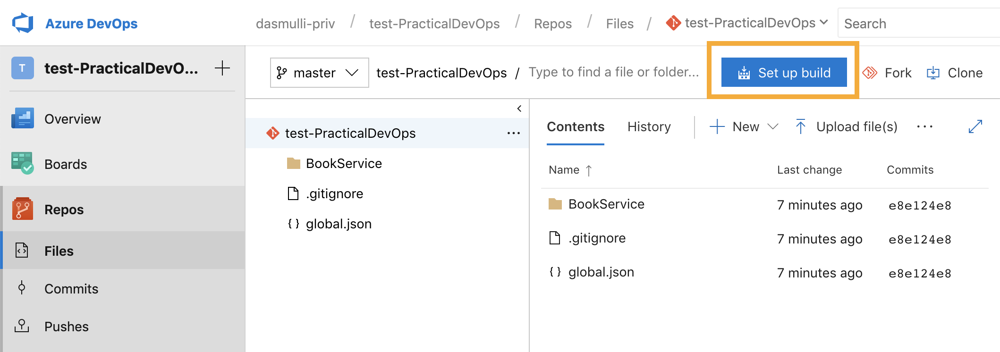

Use the ASP.NET Core template

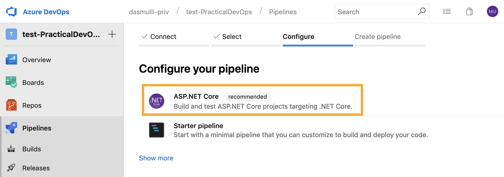

And change the yml content as follows (text version below):

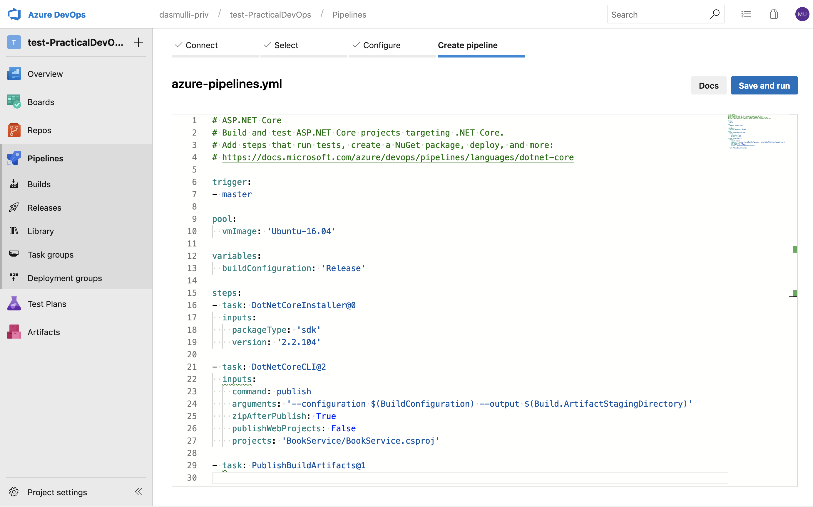


Make sure the contents of the file are:

```yml
# ASP.NET Core
# Build and test ASP.NET Core projects targeting .NET Core.
# Add steps that run tests, create a NuGet package, deploy, and more:
# https://docs.microsoft.com/azure/devops/pipelines/languages/dotnet-core

trigger:
- master

pool:
  vmImage: 'Ubuntu-16.04'

variables:
  buildConfiguration: 'Release'

steps:
- task: DotNetCoreInstaller@0
  inputs:
    packageType: 'sdk'
    version: '2.2.104'

- task: DotNetCoreCLI@2
  inputs:
    command: publish
    arguments: '--configuration $(BuildConfiguration) --output $(Build.ArtifactStagingDirectory)'
    zipAfterPublish: True
    publishWebProjects: False
    projects: 'BookService/BookService.csproj'

- task: PublishBuildArtifacts@1
```

Now hit "Save and run" and commit the file directoy to the master branch via the dialog:

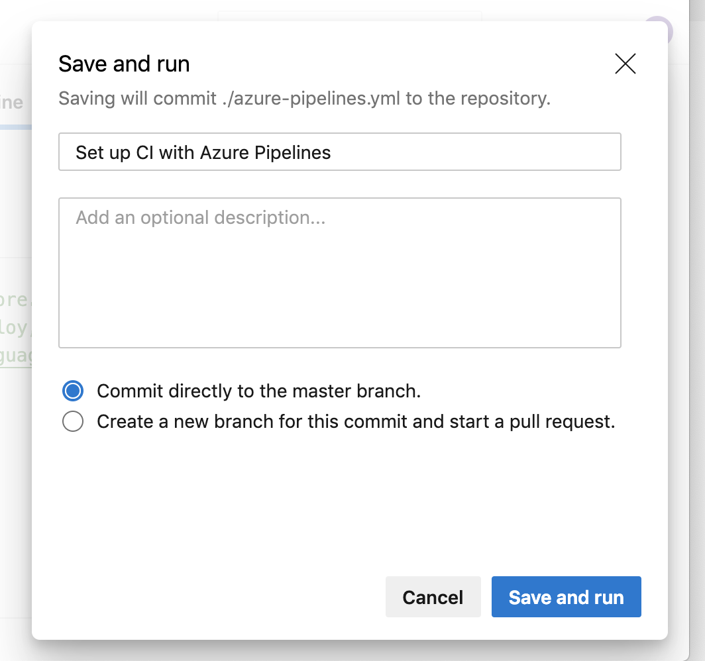

Observe that the build should have completed and there is an artifact output:

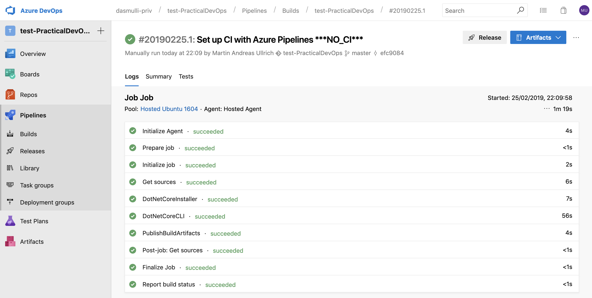

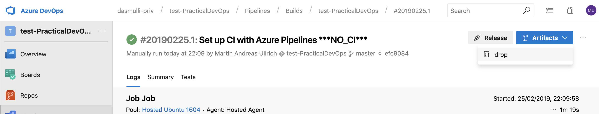

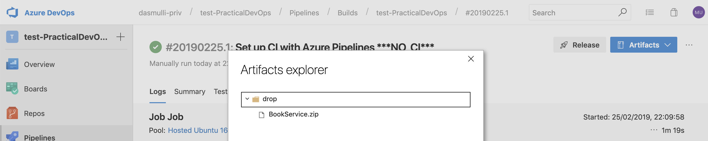

2. Set up the repository so that no one can commit to the `master` branch but has to use pull requests instead:

To do this, open the branch policies for the `master` branch:

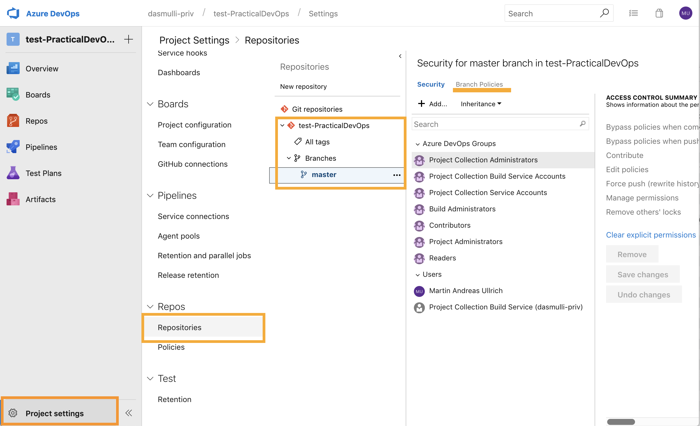

Requre a reviewer but also allow reviewing your own code for now (demo purposes):

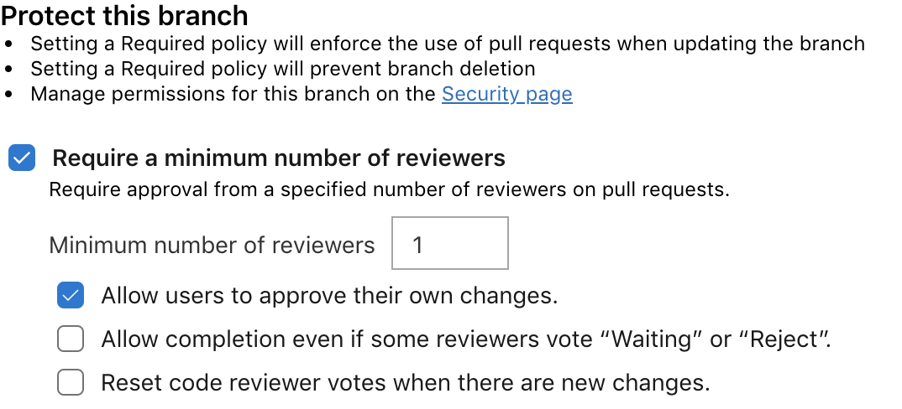

Then add a build validation policy. This will run the build pipeline for the pull request, only allowing you to merge code that successfully builds.

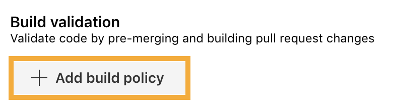

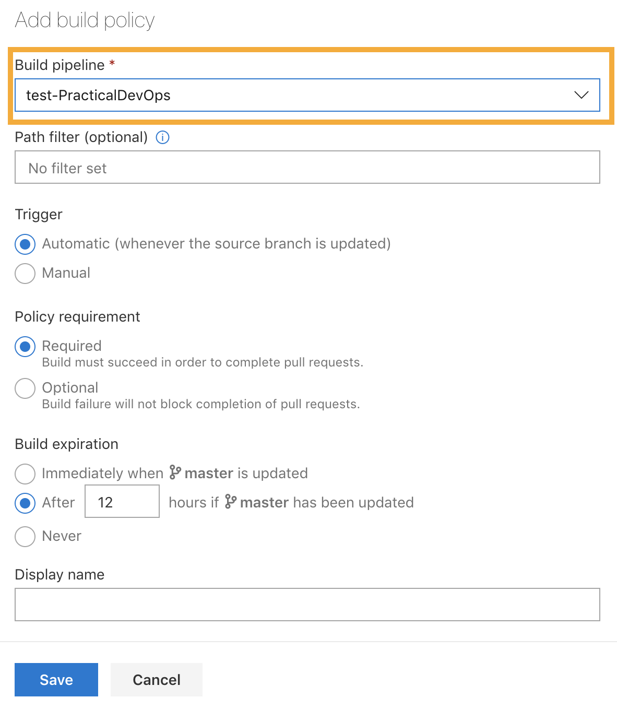

Don't forget to **save changes** since this dialog doesn't auto-save!

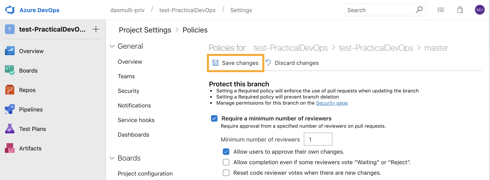

3. Let's test our policies. Best we add some test for our project.

First, create a separate branch based off of the latest `master` (note that we commited to `master` while setting up our pipeline).

```sh
> git pull
> git checkout -b feature/tests
```

Now copy the folder `BookServiceTests` from the `02_Tests` folder next to the `BookService` folder in your repository.

Then change the `azure-pipelines.yml` file to the following:

```yml
# ASP.NET Core
# Build and test ASP.NET Core projects targeting .NET Core.
# Add steps that run tests, create a NuGet package, deploy, and more:
# https://docs.microsoft.com/azure/devops/pipelines/languages/dotnet-core

trigger:
- master

pool:
  vmImage: 'Ubuntu-16.04'

variables:
  buildConfiguration: 'Release'

steps:
- task: DotNetCoreInstaller@0
  inputs:
    packageType: 'sdk'
    version: '2.2.104'

- task: DotNetCoreCLI@2
  inputs:
    command: publish
    arguments: '--configuration $(BuildConfiguration) --output $(Build.ArtifactStagingDirectory)'
    zipAfterPublish: True
    publishWebProjects: False
    projects: 'BookService/BookService.csproj'

- task: DotNetCoreCLI@2
  inputs:
    command: test
    projects: '**/*Tests/*.csproj'
    arguments: '--configuration $(buildConfiguration) --collect "Code coverage"'

- task: PublishBuildArtifacts@1

```

Commit and push your changes using (from your repository root):

```sh
> git add .
> git commit -m "Added tests."
> git push --set-upstream origin feature/tests
```

Azure DevOps should now automatically suggest that you can create a new pull request from your newly pushed branch (if not, use Repos > Pull Requests > New Pull Request):

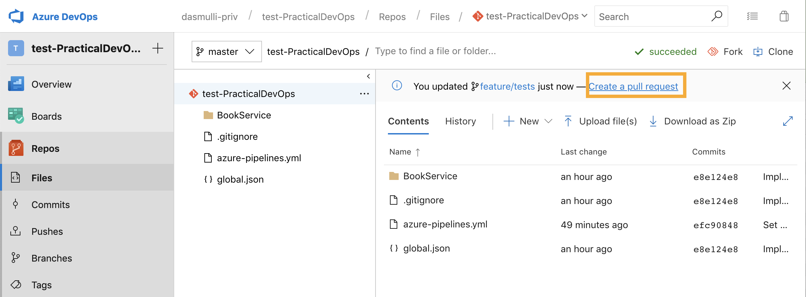

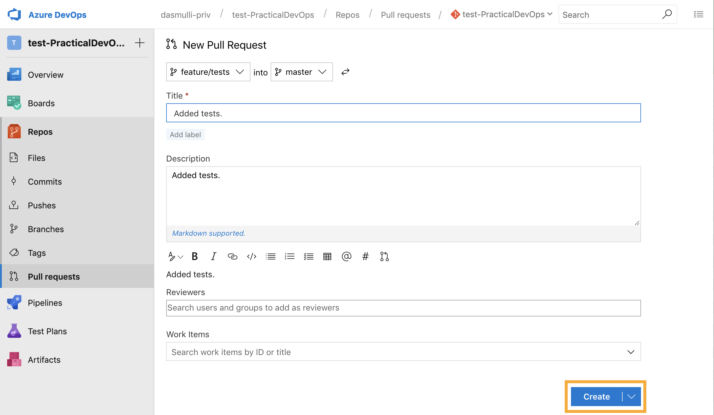

In your PR, have a look around and explore the files and options that are avilable.

Do check out the comment feature:

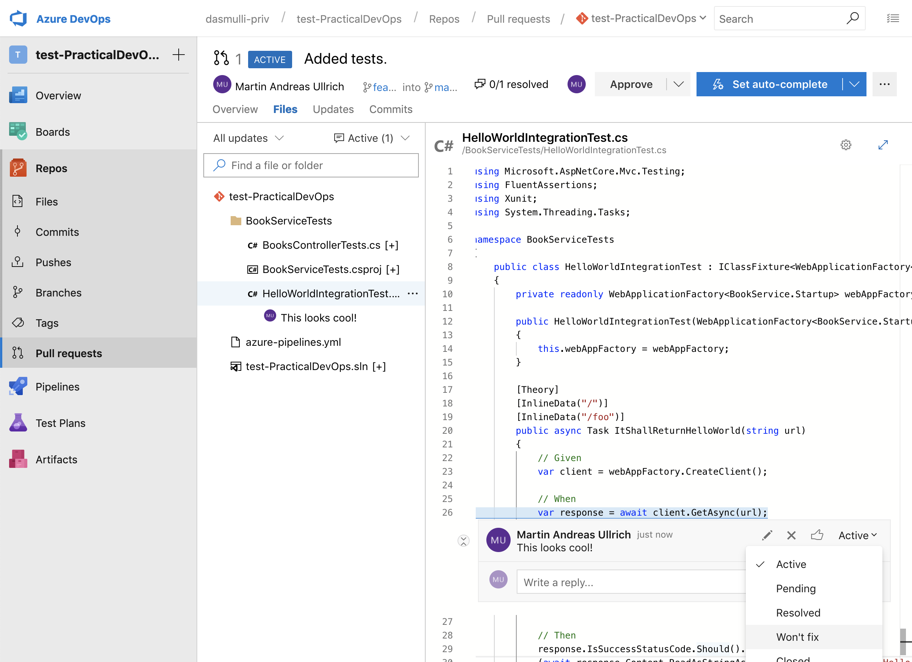

Since an approval is required, hit "Approve" on the PR. Normally this should be done by a colleague who has reviewed your changes.

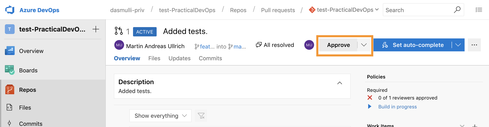

When the build has completed, all the build policies should be marked as succeeded:

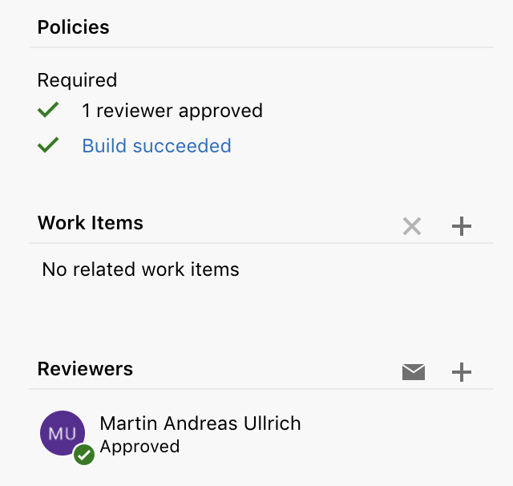

If you click on the "Build succeeded" link you can even see that there is a new test tab on the build page showing you 4 succeeded tests.

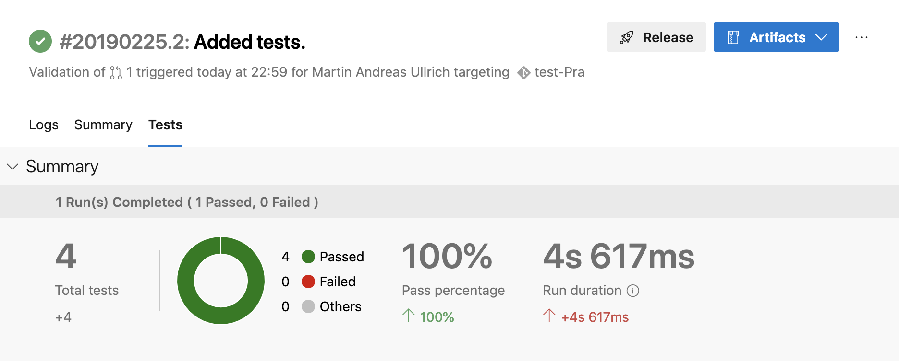

Since we're all good, complete the PR:

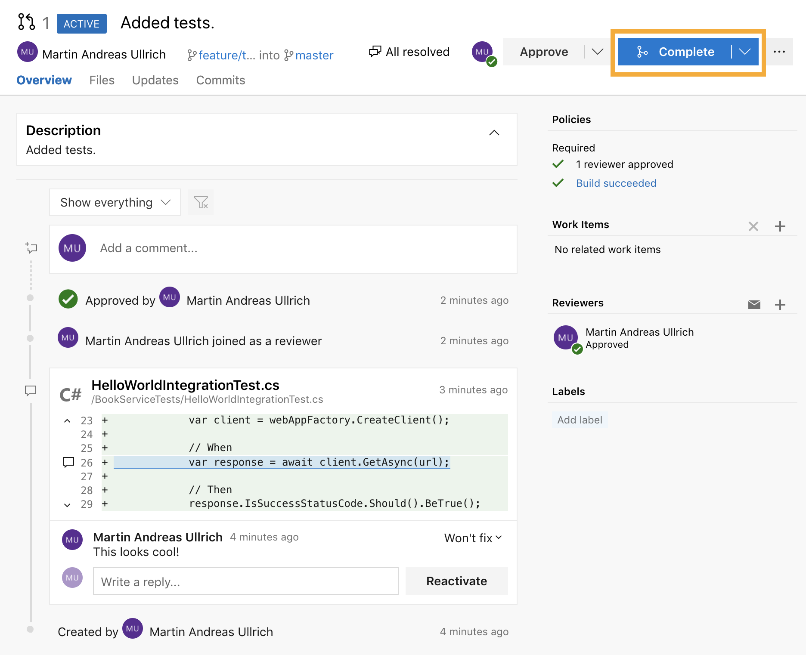
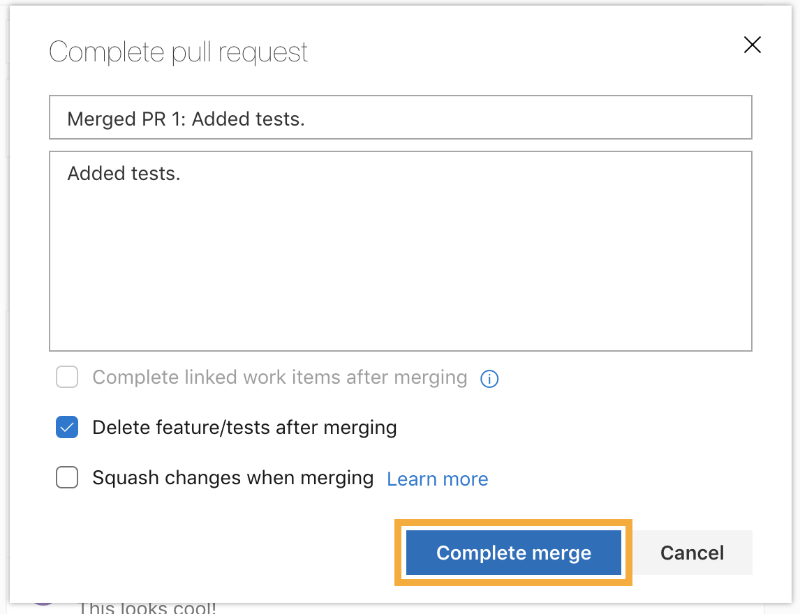

Note that this has triggered another build since we've updated the `master` branch which was set as a trigger for the pipeline in the yml file.

The pipeline build overview clearly shows the pull request AND the CI build:

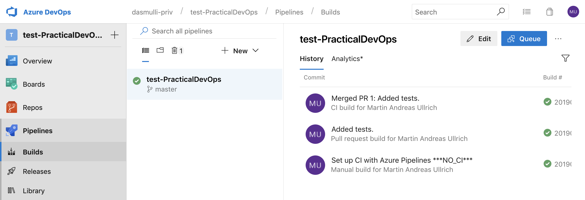